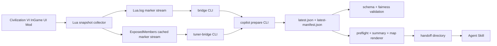

# 项目定义

`civ6-ai-copilot` 是面向 Civilization VI 的本地可见情报副官。它由一个被动 InGame UI Mod、一组本地桌面工具、一个稳定 snapshot schema 和一个 Agent Skill 组成。

项目目标不是操作游戏，而是把玩家已经理论可见的局势汇总为可审查、可验证、可交接的结构化材料，让 AI 能按用户提问语言给出更具体的回合建议。

## 产品目标

- 减少玩家反复描述局势和手工拼上下文的负担。
- 让 AI 基于本地玩家理论可见信息分析发展、城市、科技、市政、政策、战争、海军、定居和多人公开态势。
- 当信息不足时，AI 必须指导玩家回 Civ6 打开战情简报更新指定模块，而不是凭空补全。
- 支持单机使用，也支持 Windows 游戏机 + Mac Agent 机器的跨设备 handoff。

## 非目标

- 不制作作弊工具。
- 不导出隐藏地图、不可见单位、未遇见文明或其他玩家私人状态。
- 不自动点击科技、市政、生产、单位行动或外交操作。
- 不修改规则、地图、单位、资源、外交、生产、存档或网络同步状态。
- 不分发 Firaxis/2K 游戏数据库、本地化表、图标素材或真实玩家采集材料。

## 关键决策

| 编号 | 决策 | 当前方案 |
|---|---|---|
| D-001 | 项目名称 | `civ6-ai-copilot`，用于 Mod、skill、包名和发布材料。 |
| D-002 | Mod 类型 | 纯 InGame UI / utility exporter，保持 `AffectsSavedGames=0`。 |
| D-003 | 数据边界 | 默认 `visibilityMode: "player-visible"`，只导出本地玩家理论可见信息。 |
| D-004 | 传输路径 | 标准入口 `npm run copilot` 按平台选择传输：Windows/有日志走 `Lua.log` marker + `bridge`；macOS/Aspyr 走 `tuner-bridge` 读取 Mod 缓存。 |
| D-005 | 游戏内交互 | 左上 LaunchBar 副官入口，中文面板，稳定按钮名。 |
| D-006 | 情报粒度 | 手动为主，按问题更新指定模块；「回合开始自动汇总」默认关闭。 |
| D-007 | 版本规则 | 使用 `a.b.c`。`a.b` 是 skill + Mod 兼容组合，`c` 是不破坏兼容的修复。 |
| D-008 | 工具链 | Lua for Mod；TypeScript/Node for CLI、schema、package、release；research 不作为运行时依赖。 |
| D-009 | Skill 行为 | Skill 优先运行标准入口并读取其 handoff 产物；信息不足时给出具体战情简报动作。 |
| D-010 | 玩家位置表达 | 坐标用于内部分析和 SVG；面向玩家默认使用相对位置和可见锚点。 |
| D-011 | 发布渠道 | GitHub release、Steam Workshop、Agent Skill package、统一 release bundle。 |
| D-012 | 产品语言 | 用户可见文字遵循 `docs/product-language.md`：克制、专业、游戏内战情语境；README 提供简体中文和英文入口；Skill 按用户提问语言回答并使用对应 Civ6 本地化术语。 |
| D-013 | 地图规划字段 | `visibleMap.tiles` 导出已揭示/当前可见地块的规划事实：地形、地貌、可见资源、河流边、淡水、丘陵/山脉/水域/悬崖、改良、路线、区域、吸引力和基础产出；字段缺失表示当前 API 未提供或当前玩家不可识别，不代表事实不存在。 |

影响这些决策的变更需要先更新本表或新增 ADR，再进入实现。

## 总体架构



分层职责：

- `mod/`：在 Civ6 UI 环境中收集并导出本地玩家理论可见信息。
- `tools/bridge/`：解析 `Lua.log` marker，校验 checksum、schema 和 fairness。
- `tools/tuner-bridge/`：读取 Mod 已缓存的同一份 marker 分块，用于没有 `Lua.log` 的环境。
- `schemas/`：定义 snapshot contract。
- `tools/copilot/`：标准入口、preflight、summary、handoff 和 AI 交接材料。
- `tools/render-map/`：把玩家可见地图渲染为 hex SVG。
- `skill/`：Agent Skill，负责情报更新引导，并按用户提问语言提供建议。
- `tests/`：自动化测试、fixture 和手工测试模板。
- `docs/`：公开设计、安装、协议、测试和发布文档。
- `research/`：调研记录，不作为发布运行时依赖。

## 多人公平边界

允许导出：

- 本地玩家自己的城市、单位、资源、科技、市政、政体、政策和通知。
- 本地玩家已探索或当前可见的地图地块。
- 当前视野内可见的他方单位、城市、区域和改良。
- 已遇见文明的公开信息，例如战争/和平状态和公开军事分数。

禁止导出：

- 未探索地图。
- 当前不可见的敌方单位。
- 未遇见文明身份和状态。
- 其他玩家城市队列、政策卡、科技/市政进度、资源库存。
- 游戏内部 AI 计划、随机种子、隐藏外交和未来事件。

多人测试必须让两名玩家分别导出自己的 snapshot，并交叉确认双方 `localPlayerId`、可见地图和单位集合互不越界。

## Snapshot 约束

顶层 snapshot 必须包含：

- `schemaVersion`
- `source.modId`
- `source.modVersion`
- `source.compatVersion`
- `source.protocolVersion`
- `source.visibilityMode`
- `session.sessionId`
- `session.gameTurn`
- `localPlayer.localPlayerId`
- `modules`

事实对象尽量包含：

- `source`
- `visibility`
- `confidence`

选择性汇总未请求的模块可以保留 schema 占位，但必须以 `modules` 和 `confidence` 表示它不可用于强结论。AI 不得因为顶层字段存在就把模块当成已覆盖。

## 版本策略

版本集中在 `project-version.json`：

```json
{
  "version": "0.1.0",
  "compatVersion": "0.1",
  "protocolVersion": "0.1.0",
  "schemaVersion": "0.1.0"
}
```

规则：

- `a`：大版本，允许破坏性架构或协议变化。
- `b`：功能版本，`skill` 和 `Mod` 的 `a.b` 必须一致才视为兼容组合。
- `c`：patch 修复，不改变主要 contract；patch 不一致可以继续分析，但应提示更新。

修改 schema 或协议时必须同步更新 fixtures、validator、bridge/tuner tests、preflight/summary、skill references 和相关文档。

## UI 与 Skill 契约

稳定按钮/模块名：

| UI 名称 | 模块键 | 用途 |
|---|---|---|
| 汇总本回合 | `turn` | 本回合基础上下文 |
| 更新地图情报 | `visibleMap` | 战争、海军、定居、前线、资源岛 |
| 城市运营 | `cities` | 逐城生产、区域、住房、产出 |
| 军事态势 | `units` | 战争、防守、探索、单位行动 |
| 科技市政 | `techs`, `civics` | 尤里卡、鼓舞、路线规划 |
| 政体政策 | `government`, `policies` | 换卡、政策槽、爆发回合 |
| 资源库存 | `resources` | 战略资源、奢侈品、升级、交易 |
| 公开外交 | `diplomacyPublic` | 战争风险、已遇见文明、公开分数 |
| 完整战情简报 | `full` | 首次使用、诊断、版本变化后重建上下文 |

Skill 判断信息不足时应输出具体动作，例如：

```text
判断前需要前线可见地块和单位位置。请打开战情简报，点击「更新地图情报」，等 bridge 刷新 latest.json 后再判断是否开战。
```

## 测试策略

自动化测试覆盖：

- schema/fairness validation
- bridge marker parser、checksum、writer manifest
- tuner-bridge fake socket
- preflight/summarize/handoff
- map renderer
- package/release manifest
- Mod safety/static validation
- skill docs/package validation
- documentation command consistency
- privacy check
- RC check

手工测试覆盖：

- Windows Civ6 加载、Additional Content、LaunchBar 副官入口和 `Lua.log` 导出。
- 两名真人玩家同一局多人公平测试。
- Mac Agent handoff 读取顺序和信息不足阻断行为。

## Definition of Done

功能完成必须满足：

- 输入输出有 schema、文档或 CLI help。
- 自动化测试覆盖可稳定验证的行为。
- 涉及真实游戏的部分有手工测试模板或证据字段。
- 多人公平影响已评估。
- 不硬编码个人路径。
- 不引入真实玩家采集材料。
- AI 回答能说明数据来源、置信度和信息限制。
