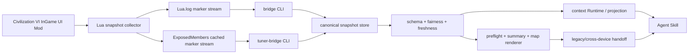

# 项目定义

`civ6-ai-copilot` 是面向 Civilization VI 的本地可见情报副官。它由一个被动 InGame UI Mod、一组本地桌面工具、一个稳定 snapshot schema 和一个 Agent Skill 组成。

项目目标不是操作游戏，而是把玩家已经理论可见的局势汇总为可审查、可验证、可交接的结构化材料，让 AI 能按用户提问语言给出更具体的回合建议。

## 产品目标

- 减少玩家反复描述局势和手工拼上下文的负担。
- 让 AI 基于本地玩家理论可见信息分析发展、城市、科技、市政、政策、战争、海军、定居和多人公开态势。
- 当信息不足时，AI 必须指导玩家回 Civ6 打开战情简报更新指定模块，而不是凭空补全。
- 支持单机使用，也支持 Windows 游戏机 + Mac Agent 机器的跨设备 handoff。

## 非目标

- 不制作作弊工具。
- 不导出隐藏地图、不可见单位、未遇见文明或其他玩家私人状态。
- 不自动点击科技、市政、生产、单位行动或外交操作。
- 不修改规则、地图、单位、资源、外交、生产、存档或网络同步状态。
- 不分发 Firaxis/2K 游戏数据库、本地化表、图标素材或真实玩家采集材料。

## 关键决策

| 编号 | 决策 | 当前方案 |
|---|---|---|
| D-001 | 项目名称 | `civ6-ai-copilot`，用于 Mod、skill、包名和发布材料。 |
| D-002 | Mod 类型 | 纯 InGame UI / utility exporter，保持 `AffectsSavedGames=0`。 |
| D-003 | 数据边界 | 默认 `visibilityMode: "player-visible"`，只导出本地玩家理论可见信息。 |
| D-004 | 传输路径 | 标准入口 `npm run copilot` 按平台选择传输：Windows/有日志走 `Lua.log` marker + `bridge`；macOS/Aspyr 走 `tuner-bridge` 读取 Mod 缓存。 |
| D-005 | 游戏内交互 | 左上 LaunchBar 副官入口，中文面板，稳定按钮名。 |
| D-006 | 情报粒度 | 手动为主；按问题分析已采集模块。「每回合自动更新」默认关闭。 |
| D-007 | 版本规则 | 使用 `a.b.c`。`a.b` 是 skill + Mod 兼容组合，`c` 是不破坏兼容的修复。 |
| D-008 | 工具链 | Lua for Mod；TypeScript/Node for CLI、schema、package、release；research 不作为运行时依赖。 |
| D-009 | Skill 行为 | Skill 日常分析优先调用单一 context Runtime contract；handoff/preflight/summarize 保留为兼容与诊断路径。信息不足时只转述 Runtime 给出的战情简报动作。 |
| D-010 | 玩家位置表达 | 坐标用于内部分析和 SVG；面向玩家默认使用相对位置和可见锚点。 |
| D-011 | 发布渠道 | GitHub release、Steam Workshop、Agent Skill package、统一 release bundle。 |
| D-012 | 产品语言 | 用户可见文字遵循 `docs/product-language.md`：克制、专业、游戏内战情语境；README 提供简体中文和英文入口；Skill 按用户提问语言回答并使用对应 Civ6 本地化术语。 |
| D-013 | 地图规划字段 | `visibleMap.tiles` 仅在当前可见地块导出规划事实：地形、地貌、可见资源、河流边、淡水、丘陵/山脉/水域/悬崖、改良、路线、区域、吸引力和基础产出；字段缺失表示当前 API 未提供或当前玩家不可识别，不代表事实不存在。 |
| D-014 | 汇总性能 | 地图扫描和日志分块输出通过 UI update 分帧执行；删除 sender SHA/hash phase，每帧输出 64 chunks。完整更新的采集范围由 D-020/D-021 规定，手动和自动完整更新均包含预算限制的可见地图；分帧与地图预算机制仍适用。 |
| D-015 | 0.2 协议（所有者本轮确认） | 正式删除 transport checksum 和 localPlayerNameHash；Node manifest 的 checksumSha256 仅为 latest.json 文件指纹。 |
| D-016 | 专题刷新（所有者本轮授权） | moduleStatus 逐模块记录 capturedTurn/capturedAt/exportId；同 session、同玩家、同回合整模块替换/合并，跨回合移除旧 payload，仅保留过期采集记录。Mod 缓存累积当前回合模块，保证 tuner 只读取最后一次缓存时不丢专题。 |
| D-017 | 迷雾与采样（所有者本轮确认） | 不从迷雾中的当前 Plot 读取动态状态；资源数量须同时满足当前可见且资源类型已识别。地图限额优先分配当前视野和己方单位/城市附近；详细 getter 仅用于入选地块。 |
| D-018 | 决策数据（所有者本轮授权） | 仅添加有原生 UI 调用依据的己方城市、单位、研究、政策和经济字段；不可用字段省略，不伪装为零。移除未实现 notifications 模块。摘要按确定性行动优先级排序。 |
| D-019 | 会话与偏好 | exportId 独立唯一；无法证明跨载入稳定的游戏 ID 时使用明确标注的本次载入 session，不以地图种子或回合号冒充游戏 ID；跨载入趋势及偏好持久化待验证。 |
| D-020 | 首批决策数据（所有者已确认） | 手动入口统一为「更新战情」并采集完整已实现模块。补己方选择上下文、城市基础设施/生产/粮食、单位状态、总督、商路和已遇见城邦使者；仅使用有原生 UI 依据的只读接口，缺失与不适用明确表达。同步升级 0.3 contract、Skill 和验证；不包含第二批复杂行动枚举或自动游戏操作。自动更新范围由 D-021 覆盖。 |
| D-021 | 完整自动更新与面板整理（所有者本轮授权） | 根据实机速度反馈，开启自动更新后每个己方回合刷新全部已实现模块，包含有预算限制的可见地图，与手动更新采用相同采集范围；覆盖 D-014/D-020 的轻量自动路径，保留默认关闭、延迟执行、回合去重、忙碌保护和跨回合取消。面板统一内容边界与按钮样式，压缩空白，仅呈现更新状态、采集回合、进度和玩家操作；实现术语保留在诊断与开发文档，不展示给玩家。不改变多人可见性边界，不新增无界地图扫描。 |
| D-022 | Agent Runtime Contract | 日常 Agent 分析改为一次调用 `context`：Runtime 完成路径发现、平台取数、唯一当前 snapshot 选择、manifest/schema/fairness 校验，并返回带 `exportId/sessionId/gameTurn` 身份的 JSON contract。Agent 不应在正常路径研究源码、搜索 tooling、手工挑选历史 snapshot 或拼接 handoff。 |
| D-023 | Agent 组装查询（所有者已确认） | Skill 列出可读取的模块和派生项。Agent 根据用户问题选择 `--module`，并可另要 `--adjacent-units` 与 `--render-map`。不传模块时返回最后一次成功汇总的全部已采集模块。`--query` 只记录原话，不参与选择。`unavailable` 写入 gaps，不阻断 `ready`。导出时间不作为拒绝条件。游戏刚刚写完的导出整份成为当前战情，回合变小同样覆盖。`needs-game-refresh` 只表示还没有写完的导出。 |

影响这些决策的变更需要先更新本表或新增 ADR，再进入实现。

## 总体架构


```mermaid
flowchart LR
  A["Civilization VI InGame UI Mod"] --> B["Lua snapshot collector"]
  B --> C["Lua.log marker stream"]
  B --> D["ExposedMembers cached marker stream"]
  C --> E["bridge CLI"]
  D --> F["tuner-bridge CLI"]
  E --> G["canonical snapshot store"]
  F --> G
  G --> H["schema + fairness + freshness"]
  H --> CXT["context Runtime / projection"]
  CXT --> K["Agent Skill"]
  H --> I["preflight + summary + map renderer"]
  I --> J["legacy/cross-device handoff"]
  J --> K
```

分层职责：

- `mod/`：在 Civ6 UI 环境中收集并导出本地玩家理论可见信息。
- `tools/bridge/`：解析 `Lua.log` marker，校验分块结构、schema 和 fairness。
- `tools/tuner-bridge/`：读取 Mod 已缓存的同一份 marker 分块，用于没有 `Lua.log` 的环境。
- `schemas/`：定义 snapshot contract。
- `tools/copilot/`：单一 context Runtime、兼容的 prepare/handoff、preflight、summary 和 AI 交接材料。
- `tools/render-map/`：把玩家可见地图渲染为 hex SVG。
- `skill/`：Agent Skill，负责情报更新引导，并按用户提问语言提供建议。
- `tests/`：自动化测试、fixture 和手工测试模板。
- `docs/`：公开设计、安装、协议、测试和发布文档。
- `research/`：调研记录，不作为发布运行时依赖。

## 多人公平边界

允许导出：

- 本地玩家自己的城市、单位、资源、科技、市政、政体、政策和通知。
- 本地玩家已探索或当前可见的地图地块。
- 当前视野内可见的他方单位、城市、区域和改良。
- 已遇见文明的公开信息，例如战争/和平状态和公开军事分数。

禁止导出：

- 未探索地图。
- 当前不可见的敌方单位。
- 未遇见文明身份和状态。
- 其他玩家城市队列、政策卡、科技/市政进度、资源库存。
- 游戏内部 AI 计划、随机种子、隐藏外交和未来事件。

多人测试必须让两名玩家分别导出自己的 snapshot，并交叉确认双方 `localPlayerId`、可见地图和单位集合互不越界。

## Snapshot 约束

顶层 snapshot 必须包含：

- `schemaVersion`
- `source.modId`
- `source.modVersion`
- `source.compatVersion`
- `source.protocolVersion`
- `source.visibilityMode`
- `session.sessionId`
- `session.gameTurn`
- `localPlayer.localPlayerId`
- `modules`

事实对象尽量包含：

- `source`
- `visibility`
- `confidence`

选择性汇总未请求的模块可以保留 schema 占位，但必须以 `modules` 和 `confidence` 表示它不可用于强结论。AI 不得因为顶层字段存在就把模块当成已覆盖。

## 版本策略

版本集中在 `project-version.json`：

```json
{
  "version": "0.3.3",
  "compatVersion": "0.3",
  "protocolVersion": "0.3.0",
  "schemaVersion": "0.3.0"
}
```

规则：

- `a`：大版本，允许破坏性架构或协议变化。
- `b`：功能版本，`skill` 和 `Mod` 的 `a.b` 必须一致才视为兼容组合。
- `c`：patch 修复，不改变主要 contract；patch 不一致可以继续分析，但应提示更新。

修改 schema 或协议时必须同步更新 fixtures、validator、bridge/tuner tests、preflight/summary、skill references 和相关文档。

## UI 与 Skill 契约

手动完整刷新通过「更新战情」触发；可选的「每回合自动更新」默认关闭，开启后每个己方回合同样刷新全部已实现模块和预算限制地图。意图和模块 key 是内部能力名，不对应玩家可点击的专题按钮。

稳定按钮/模块名：

| UI 名称 | 模块键 | 用途 |
|---|---|---|
| 更新战情 | `full` | 手动完整刷新所有已实现模块，包含地图 |
| 每回合自动更新 | `full` + `auto-turn` | 默认关闭；开启后每个本地玩家回合刷新所有已实现模块和预算限制地图 |

内部模块包括 `selection`、`cities`、`units`、`governors`、`trade`、`cityStates`、`techs`、`civics`、`government`、`policies`、`resources`、`diplomacyPublic`、`visibleMap` 和 `economy`。城市/单位等模块用于意图分析和有界摘要，玩家只需通过「更新战情」刷新。

Skill 日常调用 `context --query "<用户原话>"`。Runtime 返回 `status=ready` 时直接基于 `summary/context` 分析；返回 `needs-game-refresh` 时只输出具体动作，例如：

```text
判断前需要前线可见地块和单位位置。请打开战情简报，点击「更新战情」，等 bridge 刷新 latest.json 后再判断是否开战。
```

## 测试策略

自动化测试覆盖：

- schema/fairness validation
- bridge marker parser、分块完整性、writer manifest 文件指纹
- tuner-bridge fake socket
- context Runtime、preflight/summarize/handoff
- map renderer
- package/release manifest
- Mod safety/static validation
- skill docs/package validation
- documentation command consistency
- privacy check
- RC check

手工测试覆盖：

- Windows Civ6 加载、Additional Content、LaunchBar 副官入口和 `Lua.log` 导出。
- 两名真人玩家同一局多人公平测试。
- Mac Agent handoff 读取顺序和信息不足阻断行为。

## Definition of Done

功能完成必须满足：

- 输入输出有 schema、文档或 CLI help。
- 自动化测试覆盖可稳定验证的行为。
- 涉及真实游戏的部分有手工测试模板或证据字段。
- 多人公平影响已评估。
- 不硬编码个人路径。
- 不引入真实玩家采集材料。
- AI 回答能说明数据来源、置信度和信息限制。
